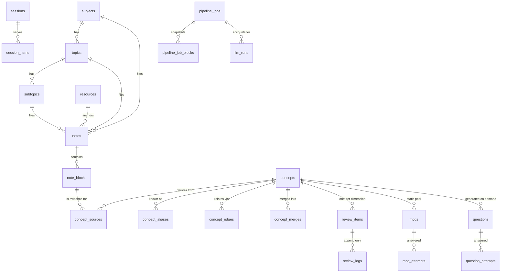

# Data model

The schema from spec §6 `[LOCKED]`, as built. SQLite in WAL mode,
`busy_timeout=5000`, `foreign_keys=ON`.

Defined in `src/revisenlearn/models.py`; created by
`migrations/versions/6a9a48c36ece_*.py`, with the FTS5 tables added by
`b1c2d3e4f5a6_fts5_indexes.py`.

**Nothing is ever hard-deleted** (principle §1.7). Every table the spec gives a
`deleted_at` has one, and application code stamps it rather than issuing
`DELETE`. The one exception the spec itself carves out is §7.4: when the user
explicitly deletes a stale concept, its MCQs are hard-deleted.

---

## The shape of it

Five clusters, in dependency order:

1. **Hierarchy** — where knowledge is filed
2. **Notes** — what the user writes
3. **Concepts** — what the app extracts and keeps
4. **Review** — how it comes back
5. **Accounting** — what the pipeline and the LLM did, and what it cost



---

## 1. Hierarchy

Three fixed levels, no arbitrary nesting (§3 `[LOCKED]`).

```
Subject       GenAI
  Topic         Retrieval
    Subtopic      Hybrid search
```

| Table | Notes |
|---|---|
| `subjects` | `id, name, colour, sort_order, created_at, deleted_at` |
| `topics` | `+ subject_id` |
| `subtopics` | `+ topic_id` — optional level; a note may hang off a Topic |
| `tags` | Flat, user-created, never hierarchical |
| `taggings` | Polymorphic: `target_type` ∈ `note \| resource \| concept` |

## 2. Notes

| Table | Notes |
|---|---|
| `notes` | One per (Subtopic, day) by default. `subject_id`/`topic_id` are denormalised from the subtopic so a note is queryable at any level without a join chain. |
| `note_blocks` | One paragraph / bullet / heading. The unit of content hashing. |
| `resources` | Both the study to-do and the anchor for notes (§5). |

### The processed-state indicator (§4.2 `[LOCKED]`)

`note_blocks` carries two hashes, and their relationship is the whole indicator:

| Condition | State | Renders as |
|---|---|---|
| `processed_hash IS NULL` | **unprocessed** | plain |
| `processed_hash = content_hash` | **processed** | pale blue left border `#DBEAFE`, `#` superscript |
| `processed_hash ≠ content_hash` | **stale** | amber left border, `#~` superscript |

`content_hash` is SHA-256 of *normalised* text (whitespace collapsed), so
reflowing a paragraph does not invalidate the concepts derived from it.

The API computes this and returns it as `state`, so the rule lives in one place.

## 3. Concepts and identity

The concept is the durable learning object (§1.1). Notes are input; questions
are disposable.

| Table | Notes |
|---|---|
| `concepts` | `status` ∈ `active \| stale \| archived`. Both `canonical_name` (as written) and `normalised_name` (§7.1) are stored. |
| `concept_aliases` | `source` ∈ `extraction \| merge \| manual` |
| `concept_merges` | `decided_by` ∈ `auto \| user \| NULL`. **`NULL` is the merge queue** — the 0.82–0.92 similarity band awaiting a human (§7.2). `reverted_at` makes every merge reversible. |
| `concept_sources` | Links a concept to the block it came from. `invalidated_at` is stamped when that block is edited; a concept with zero valid sources goes `stale` but **keeps being scheduled** (§7.4). |
| `concept_edges` | `relation_type` ∈ `prerequisite_of \| related_to \| part_of \| contrasts_with \| depends_on \| causes`; `status` ∈ `proposed \| accepted \| rejected` |
| `embeddings` | `vector` BLOB, `target_type` ∈ `concept \| note_block`. Local `bge-small-en-v1.5`, 384-dim. |

## 4. Review

Two deliberately separate loops (§1.4). They do not share scoring machinery.

| Table | Notes |
|---|---|
| `review_items` | One FSRS state per **(Concept × Dimension)** pair — enforced by a UNIQUE constraint. Dimensions: `recall, explain, apply, debug, synthesis, interview`. |
| `review_logs` | **APPEND ONLY. No UPDATE, no DELETE, ever.** Captures before/after stability, difficulty and due date on every review, which is what makes the §21 threshold and weight guesses tunable from evidence later. |
| `mcqs` / `mcq_attempts` | Static, eagerly generated, batch-priced. `status` ∈ `active \| retired`. |
| `questions` / `question_attempts` | Prose, generated on demand. `evaluator_rating`, `user_override_rating` and `final_rating` are all kept separately so an override never erases what the evaluator said. |
| `misconceptions` | Accumulates per concept with `times_seen`. |
| `sessions` / `session_items` | `session_type` ∈ `practice \| revision`; `selection_bucket` ∈ `new \| failed \| random \| due`. |

## 5. Pipeline and accounting

| Table | Notes |
|---|---|
| `pipeline_jobs` | One button-press. `status` ∈ `queued \| running \| succeeded \| failed \| cancelled`. |
| `pipeline_job_blocks` | **The §4.3 snapshot.** At button-press the text and hash of every unprocessed or stale block is copied here, and that copy is what the job works on — so the user can keep typing mid-run and trust the indicators. |
| `llm_runs` | Every LLM output logged with prompt version, model and token counts — no exceptions (§1.6). Carries `cached_tokens` and `request_mode` (`standard \| batch`) so the §12.4 cost optimisations are measurable, not assumed. |
| `settings` | `key` / `value_json`. Seeded with the §12.5 pricing table (including `expires: 2026-12-31`) and the §7.2 similarity thresholds. |

---

## Indexes

All eleven from §6:

```
notes(study_date)                       concept_edges(source_concept_id)
note_blocks(note_id, position)          concept_edges(target_concept_id)
concepts(normalised_name)               review_items(due_at)
concept_sources(concept_id)             review_items(concept_id, dimension) UNIQUE
mcqs(concept_id, status)                review_logs(review_item_id, created_at)
llm_runs(created_at)                    llm_runs(concept_id)
```

`tests/test_foundation.py` asserts every table and every index exists after
`alembic upgrade head`, so drift from §6 fails the suite.

## Full-text search

```sql
note_blocks_fts(text, note_id, note_block_id)          -- porter unicode61
concepts_fts(canonical_name, definition, concept_id)   -- porter unicode61
```

Standalone FTS5 tables, not external-content ones — see `DECISIONS.md` §4.
Kept in step by `db.reindex_block` on every block write, including
soft-deletes, which must leave the index while staying in `note_blocks`.

## Write discipline

All writes go through one `Session` factory with a short-lived transaction
(`db.session_scope`). The pipeline worker thread takes an application-level
`threading.Lock` (`db.write_lock`) around its transactions. One engine, one
connection pool, never two.
